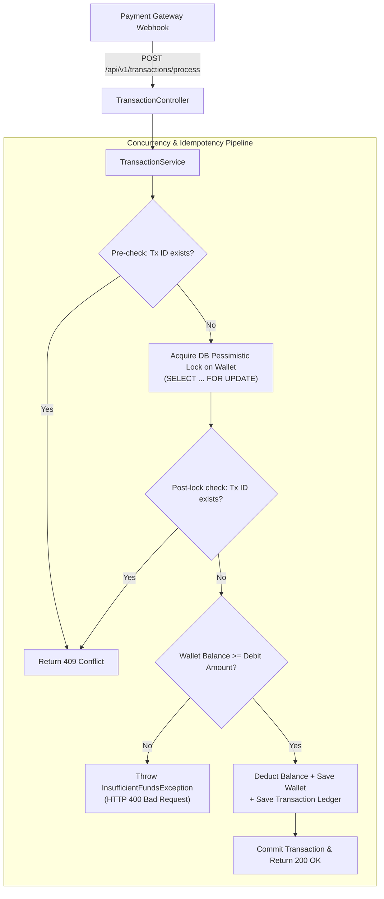

# Internal Transaction Ledger Service
### Idempotent Payment & Wallet Event Processor

[]()
[]()
[]()
[]()

Production-grade Spring Boot service designed to process payment gateway debit webhooks idempotently and reliably under high concurrency.

---

## Key Highlights

- **Zero-Config Execution**: Evaluated directly in IntelliJ IDEA or via `mvn test` without setting up any external databases or containers.
- **Strict Idempotency**: Guarantees that concurrent duplicate webhooks arriving within milliseconds deduct the wallet balance **strictly once**; duplicate requests return `409 Conflict`.
- **Concurrency & Race Condition Prevention**: Uses **database-level pessimistic write locking** (`SELECT ... FOR UPDATE`) to prevent negative balances during concurrent debit bursts.
- **Documented Decision Log**: See [`DECISIONS.md`](./DECISIONS.md) for architectural justifications and an honest analysis of AI assistance during design.

---

## Tech Stack

- **Language**: Java 17+ (built and tested with Java 21 / 22)
- **Framework**: Spring Boot 3.3.4 (Spring Web, Spring Data JPA, Bean Validation)
- **Database**: In-memory H2 database
- **Testing**: JUnit 5, AssertJ, Spring Boot Test (`TestRestTemplate` over real random HTTP ports)

---

## Architecture Overview



---

## API Specification

### Webhook Ingestion Endpoint
- **URL**: `POST /api/v1/transactions/process`
- **Content-Type**: `application/json`

#### Request Payload
```json
{
  "transactionId": "550e8400-e29b-41d4-a716-446655440000",
  "userId": "123e4567-e89b-12d3-a456-426614174000",
  "amount": 250.00,
  "type": "DEBIT"
}
```

#### Response (Success - 200 OK)
```json
{
  "transactionId": "550e8400-e29b-41d4-a716-446655440000",
  "userId": "123e4567-e89b-12d3-a456-426614174000",
  "amount": 250.00,
  "type": "DEBIT",
  "status": "SUCCESS",
  "currentBalance": 750.00,
  "message": "Transaction processed successfully",
  "timestamp": "2026-09-15T11:46:57.969Z"
}
```

#### Response (Duplicate Webhook - 409 Conflict)
```json
{
  "status": 409,
  "error": "Conflict",
  "message": "Transaction 550e8400-e29b-41d4-a716-446655440000 has already been processed.",
  "timestamp": "2026-09-15T11:46:57.975Z"
}
```

#### Response (Insufficient Funds - 400 Bad Request)
```json
{
  "status": 400,
  "error": "Insufficient Funds",
  "message": "Insufficient balance in wallet. Current: 0.00, Requested: 100.00",
  "timestamp": "2026-09-15T11:46:58.083Z"
}
```

---

## Running the Integration Tests

The test suite requires **zero external configuration**.

### Option A: Via IntelliJ IDEA (Evaluator Friendly)
1. Open IntelliJ IDEA -> **File** -> **Open...** -> Select this repository directory.
2. Navigate to `src/test/java/com/wondrx/ledger/TransactionIntegrationTest.java`.
3. Right-click `TransactionIntegrationTest` -> Click **Run 'TransactionIntegrationTest'**.
4. The test console clearly prints the **Intent** and **Result** for every scenario.

### Option B: Via Command Line (Maven)
```bash
mvn clean test
```

---

## Required Test Cases Verified

| Test Case | Scenario Description | Status |
| :--- | :--- | :---: |
| **Happy Path Test** | *Processes a single valid debit transaction successfully.* | **PASSED** |
| **Idempotency Test** | *Sends 3 identical transactionIDs simultaneously. Ensures the balance is only deducted once.* (1 succeeded with 200 OK, 2 rejected with 409 Conflict) | **PASSED** |
| **Race Condition Test** | *Sends 10 concurrent debit requests of ₹100 for a wallet with a ₹500 balance. Ensures the final balance is exactly ₹0 and 5 requests fail with insufficient funds.* | **PASSED** |

---

## Project Structure
```text
.
├── DECISIONS.md                      # Answers to concurrency & AI decision questions
├── README.md                         # Project documentation and instructions
├── pom.xml                           # Maven dependencies and build configuration
└── src
    ├── main
    │   ├── java/com/wondrx/ledger
    │   │   ├── controller            # REST Controllers
    │   │   ├── dto                   # Request / Response records
    │   │   ├── entity                # JPA Entities (Wallet, Transaction)
    │   │   ├── exception             # Custom exceptions & RestControllerAdvice
    │   │   ├── repository            # Spring Data Repositories with @Lock
    │   │   ├── service               # Transaction orchestration logic
    │   │   └── LedgerApplication.java
    │   └── resources
    │       └── application.yml       # In-memory H2 config
    └── test
        └── java/com/wondrx/ledger
            └── TransactionIntegrationTest.java # JUnit 5 zero-config tests
```
